> ## “DevOps is not a Goal, But a never-ending process of continual improvement” – Jez Humble
 

The below is built using the [build-svg.ps1](https://github.com/grant-steinfeld/grant-steinfeld/blob/master/build-svg.ps1) PowerShell script, which runs daily at 3am via this [GitHub Action](https://github.com/grant-steinfeld/grant-steinfeld/blob/master/.github/workflows/readme.yml).

 

- 🔭 I’m currently working on Arduino telemetry data - pushed via WiFi to Node-RED to InfluxDB
- 🌱 I’m currently learning ... https://epicreact.dev - Kent C. Dobbs
- 
<!--
**Grant-Steinfeld/Grant-Steinfeld** is a ✨ _special_ ✨ repository because its `README.md` (this file) appears on your GitHub profile.

Here are some ideas to get you started:

- 🔭 I’m currently working on ...
- 🌱 I’m currently learning ...
- 👯 I’m looking to collaborate on ...
- 🤔 I’m looking for help with ...
- 💬 Ask me about ...
- 📫 How to reach me: ...
- 😄 Pronouns: ...
- ⚡ Fun fact: ...
-->
